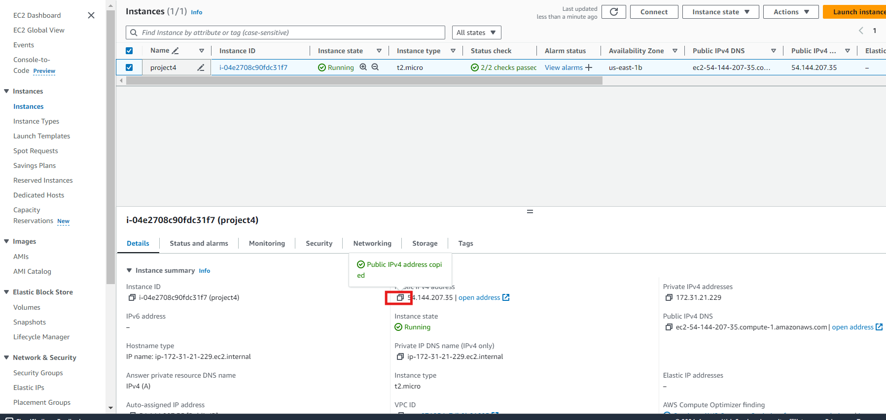

# Project4: Setup WordPress Website Using LAMP Stack

## Introduction

In this project, I will be setting up a Wordpress website. The following tools are used during this project
* Linux
* MySQL
* Apache
* PHP

Using the above listed tools and others learned from previous projects, I will be deploying an Ubuntu server, et up your LAMP stack on the server, configure the wordpress application, map the IP address to the DNS A record and finally validate the WordPress website setup by accessing the web address.

Let's dive into it..

Using the knowledge from previous projects especially project1, I was spinned up an Ubuntu server. This was successfully deployed.

* Set an inbound rule for MySQL. This is done as seen below:

* Click on Edit inbound rules and then click on Add rule as shown below:

* Click on Custom TCP on the drop-down and select MySQL/Aurora

* I then entered my server IP address and clicked on save rules as shown below:

* I then connect my terminal to Ubuntu server via SSH

## Installing the tools for Wordpress

### Installing Apache

* I run the command sudo apt update, then sudo apt install apache2 as shown below:

* I ran sudo systemctl enable apache2 for Apache to start and then ran sudo systemctl status apache2 to verify status

* To ensure the server is running, i executed curl http://localhost:80 as seen below:

* To check the response of the Apache server to requests from the internet, I copied the public IP address from the EC2 dashboard and pasted it on a web browser as seen below:

* Installation was successful

### Installing MySQL

* I run the command sudo apt install MySQL as shown below:
 

* I then run sudo mysql to log in to MySQL and ALTER USER 'root'@'localhost' IDENTIFIED WITH mysql_native_password BY 'pass'; to set password

* I run the command as attached and set password validation:

* I run the commands 1 and 2 as seen in below to enable MySQL to start on boot

### Installing PHP

* I executed the command sudo apt install php-curl php-gd php-mbstring php-xml php-xmlrpc php-soap php-intl php-zip to instal PHP:

* I also run sudo apt install php libapache2-mod-php php-mysql

* I then run php -v to see the installed version

### Creating A Virtual Host with Apache

* I used sudo mkdir /var/www/projectlamp and sudo chown -R $USER:$USER /var/www/projectlamp to create the directory for Projectlamp and assign ownership of the directory as shown below:

* Using sudo vi /etc/apache2/sites-available/projectlamp.conf, I created and opened a new configuration file in Apache's sites-available directory. A blank file was created and the configuration below was pasted:

I saved the changes by pressing the Esc key and typed :wq then pressed the Enter button

* I Run the ls command shown below to show the new file in the directory.

* The new virtual host is enabled with the a2ensite command while the Apache default website is disabled. To ensure the configuration file has no syntax errors, I run the prompt sudo apache2ctl configtest and run sudo systemctl reload apache2 to reload. All these are shown in the 2 images below:

* With all the above successfully executed, the website is now active but empty. To create index.html file, I executed the command below:

* I then used the public IP address in EC2 instance on a browser and sudo rm /var/www/projectlamp/index.html to remove the html file as seen in the 2 images below:

### Enabling PHP On The Website

* To change the precedence of index files in Apache, there's a need to edit the directory. This is done using prompt sudo nano /etc/apache2/mods-enabled/dir.conf and change the directory as shown in the images below:

* After saving, I reloaded the web browser and I have the image below:

## Installing Wordpress

* To install Wordpress, I executed the commands in the images below:

* I extracted the files from the downloaded WordPress archive, confirmed the existence of the wordpress directory as shown in the images below:

* I ran the prompt below to grant ownership of the WordPress directory and its files to the web server user (www-data):

### Creating Database For Wordpress

* I used sudo mysql -u root -p to gain access to MySQL root account and used the password that was set earlier in this project 

* To create a separate database named wp_db for WordPress to manage, I ran the command as shown below:

* I created a a MySQL user account to access the new database created above with a strong password:

* To grant your created user all privileges needed to work with the wp_db database in MySQL, I use the code command as shown below:

* I then typed exit to exit MySQL as shown below:

* To grant executable permissions recursively (-R) to the wordpress folder, change into the WordPress directory, I ran the commands shown below:

Confiurring Wordpress

* To edit the WordPress configuration file, I used the sudo nano wp-config.php command

* I updated the database settings in the file by replacing placeholders with the actual database details as shown below:

* I used the command below to modify the configuration file projectlamp.conf as seen below:

* To effect the changes made above, i run run the prompt sudo systemctl reload apache2

After the above, I opened my web browser used public IP address from EC2 instance to access the wordpress page below:

* I entered the required information and clicked on Install  as shown below

* After successfully installing wordpress, I was able to log into the admin dashboard as shown in the images below:

### Creating an A Record

Using the knowledge from previous projects especially project1 to create a hosted zone.

* Clicked on 'Create record' in Route 53

* Pasted IP address and then clicked on 'create records' to create the root domain. This same process is repeated for the Sub-domain as sown below:

I then used sudo nano /etc/apache2/sites-available/projectlamp.conf to update Apache configuration file in the sites-available directory to point to the domain name

* I used the command projectlamp.conf to open file in the nano text editor in order to adjust the necessary details to reflect the domain name configuration

I pasted the command shown, saved the changes and exit the editor

* I reload your Apache server to apply the changes, then opened the website from a browser as shown below:

* I oopened my Wordpress admin portal http://<domain name>/wp-admin and followed the prompts as shown below:

Successfully logged-on to Wordpress

## Installing certbot and Request For an SSL/TLS Certificate

After successfully configuring WordPress site to use my domain name, the next step is to secure it by requesting an SSL/TLS certificate. To so this, the following steps are taken

1. Install certbot using the following commands:

    a. sudo apt update

    b. sudo apt install certbot python3-certbot-apache

2. Run the command sudo certbot --apache to request your SSL/TLS certificate

* A message that the certificate has been successfully obtained is seen as shown below:

* Taking a look at the website and Wordpress, the "not secure" warning is gone, showing that the site is now safely secured with HTTPS.

End of Project4

